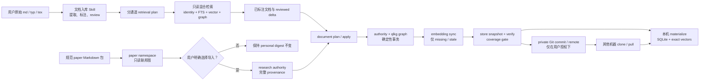
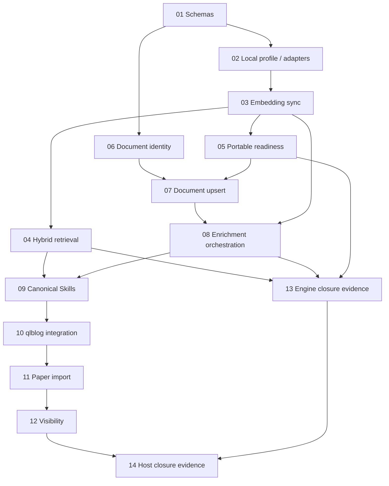

# Agentic 图谱知识库闭环规范

Status: implementation target; not yet complete

Baseline date: 2026-08-06

Contract owners: kgdistiller deterministic core and its qlblog host integration

## 1. Purpose

本文档把 kgdistiller 当前已经存在但尚未贯通的能力，定义成一组可独立实现、
验证和提交的闭环指标。它面向个人、小型、local-first 的 Agentic 知识库：

- Markdown、Typst、LaTeX 是唯一可编辑的知识 authority；
- 显式 marker、reviewed identity 和有来源的语义边定义图谱事实；
- portable store 是 Git、备份和跨机器同步单元；
- SQLite 是每台机器可删除、可重建的查询索引；
- embedding 是需要精确保存的检索资产，但不能定义节点身份或可信语义；
- Agent Skills 负责语义提取、查询规划和 review，确定性核心负责校验、事务和持久化。

本文档补充而不替代：

- [Agentic Knowledge Base Specification](agentic-knowledge-base-spec.md)；
- [Transactional ingest contract](transactional-ingest.md)；
- [Portable knowledge store development notes](portable-store-development.md)；
- [Local-first deployment and recovery](deployment.md)。

逐项修复、验收和状态记录使用
[Agentic knowledge base repair specification](agentic-knowledge-base-repair-spec.md)。
本规范定义目标合同；repair spec 只定义当前审计基线和执行顺序，不能降低本规范要求。

现有已发布 schema 名称不可修改含义。新增 required 字段、digest 规则或状态
语义时，必须发布新的 schema 版本和显式迁移。

本文档不是运行 Git push、导入论文知识、发送 provider 请求或修改个人知识
数据的授权。每个自动化任务仍必须遵守它所在仓库的 AGENTS.md 和用户授权边界。

## 2. Definition of closure

系统只有在下面六条用户路径全部通过端到端验收后，才可以称为闭环。

| ID | 用户路径 | 闭环定义 |
| --- | --- | --- |
| C-PORTABLE | 跨机器恢复 | 一个已验证 Git store 可在干净机器上无文档重解析、无文档重嵌入地 materialize，恢复精确 node vectors，并明确报告可用的检索通道 |
| C-QUERY | 知识查找 | 公开 CLI/MCP 能执行关键词、图谱和向量混合召回；每一路接收适合自身的 query；结果解释每一路是否启用、为什么命中或为什么降级 |
| C-ANNOTATED-INGEST | 标注文档入库 | 给定已完整标注的 md/typ/tex 文档，高层接口能识别 create/update/no-op/move，事务更新 authority 和 graph，补齐受影响向量，发布 portable generation，并 materialize 本地索引 |
| C-RAW-INGEST | 原始文档入库 | Skill 能从用户原始文档提取候选知识，批量复用已有身份，只为 new/partial 写词条和有证据的边，经 review 后调用标注文档入库接口 |
| C-PAPER | 论文外接 | 默认论文流程只产生隔离联邦图；用户明确选择后，才能把 selected new/partial 写入带完整来源的 research authority |
| C-HOST | 日常宿主接线 | qlblog 使用包含上述 capability 的固定引擎版本，Skills 可被发现，研究来源默认不公开，并通过宿主知识工作流和站点构建 |

“materialize 为向量数据库”在本规范中表示：本地索引持有可验证的向量并且公开
查询接口真正能执行 vector lane。第一版不要求独立向量服务或 ANN；对个人小型
知识库，SQLite 中的精确向量扫描可以合格。若规模超过实测边界，可以在不改变
portable contract 的前提下增加后端 adapter。

## 3. Target data flow



外部 provider 调用不得位于 authority/graph 原子安装的临界区内。权威写入、
embedding enrichment 和 portable publication 是可恢复、可重试但明确分阶段的
工作流；系统不得把其中一个阶段成功误报成全链路 ready。

## 4. Cross-cutting invariants

所有实现任务必须满足：

1. 确定性核心保持 provider-neutral。provider-specific SDK、鉴权和网络调用属于
   adapter 或宿主层。
2. 模型、embedding、相似度、标题、顺序和共现都不能创建 graph identity。
3. semantic similarity 只能作为召回或 review evidence，不能创建 trusted edge。
4. authority 输入只支持已经注册且受 bounded glob 管理的 md、typ、tex。
5. MCP 默认保持只读；写操作继续通过显式 plan/apply CLI 或 Python API。
6. 本地 HTTP 默认绑定 127.0.0.1，所有路径继续进行 traversal 和 symlink 检查。
7. provider credentials、查询日志、SQLite、WAL、缓存和本地 profile 不得进入
   portable store。
8. engine 仓库不得包含个人 authority、个人图谱、真实向量或凭据。
9. receipt 不得包含完整 authority、论文全文、向量 bytes 或秘密。
10. 无 provider 时，关键词、图谱、恢复和确定性入库仍然可用。
11. 每次降级必须机器可读；不得静默关闭 semantic lane 或静默发布不完整 store。
12. Markdown、Typst、LaTeX 必须在相同合同下通过 create、update 和 no-op 测试。

## 5. Required contracts

本节中的名称是目标合同。实现前必须先增加 schema fixture 和 canonical digest
测试；不能让 CLI 输出先于 schema 形成事实标准。

### 5.1 Machine-local profile

新增 `qlkg-local-profile-v1`。默认路径为
`knowledge/build/local-profile.json`，它必须被忽略且永不进入 portable store。

```json
{
  "schema": "qlkg-local-profile-v1",
  "database": "knowledge.sqlite",
  "portable_store": "/absolute/path/to/private-store",
  "embedding_profile": "primary",
  "provider_profiles": {
    "primary": {
      "adapter": "openai-compatible",
      "model": "example-model",
      "dimensions": 1536,
      "base_url": "https://example.invalid/v1",
      "credential_env": "EMBEDDING_API_KEY"
    }
  }
}
```

要求：

- `--database`、`--store` 和 `--embedding-profile` 显式参数优先于 profile；
- profile 优先于现有默认值；
- profile 中的相对 `database` 和 `portable_store` 路径按 profile 文件目录解析；
- `credential_env` 只记录环境变量名，不能记录 secret value；
- `provider_config_sha256` 只覆盖影响向量空间的非秘密字段；
- 自定义数据库位置在下一次 CLI/MCP 启动时可复用，满足“本机记住数据库”；
- 缺失 profile 时继续使用 `knowledge/build/knowledge.sqlite`。

### 5.2 Portable embedding policy and status

新增可提交的 `qlkg-embedding-policy-v1`，建议路径为
`knowledge/embedding-policy.json`。它声明 portable generation 的预期向量空间，
不包含凭据。

```json
{
  "schema": "qlkg-embedding-policy-v1",
  "profiles": [
    {
      "name": "primary",
      "provider": "openai-compatible",
      "model": "example-model",
      "dimensions": 1536,
      "required_node_types": ["knowledge"],
      "minimum_coverage": 1.0,
      "required": true
    }
  ]
}
```

新增 `kgdistiller embedding status` 和 `kgdistiller embedding sync`：

- status 按 provider/model/dimensions 分组报告 eligible、ready、missing、stale；
- sync 只嵌入 missing/stale canonical inputs；
- sync 对 unchanged nodes 发出零次 provider 请求；
- sync 可安全重试，写入前验证 graph generation 未变化；
- provider 返回错误、维度不匹配、NaN、Inf、全零或数量不符时不写入坏向量；
- semantic query 不得隐式调用 sync。

`store snapshot --require-ready` 必须执行 policy coverage gate。缺少 required
profile 或 coverage 低于阈值时，不更新顶层 portable manifest。显式
`--allow-partial` 可以产生标记为 partial 的 generation，但不能被 Skill 或部署
流程描述成 RAG-ready。

snapshot 必须先在 staging 中生成 document inventory、embedding bundle 和顶层
manifest，再执行 coverage 与完整性检查。检查失败时不得安装这些新 store artifacts。
如果 authority/graph 已经由前一阶段提交，则当前工作树明确处于
`graph-committed/portable-pending`；在 in-place layout 中，上一份完整 portable
generation 只承诺可由之前的 Git revision 恢复，不得谎称当前工作树仍通过 verify。

`store verify` 验证完整性；`store verify --require-ready` 同时验证 coverage。
两种结果必须区分：

- integrity-valid；
- retrieval-ready。

### 5.3 Retrieval plan and public hybrid search

新增 `qlkg-retrieval-plan-v1`。Query Skill 根据用户问题生成它，检索核心只执行
计划，不从一个字符串猜测所有通道意图。

```json
{
  "schema": "qlkg-retrieval-plan-v1",
  "question": "原始问题，仅用于结果上下文",
  "namespace": "personal",
  "identity_queries": ["规范概念名", "候选别名"],
  "lexical_queries": ["适合 FTS 的关键词组合"],
  "semantic_queries": ["保留语义条件的完整自然语言查询"],
  "graph": {
    "seed_ids": ["已确定身份的节点 ID"],
    "edge_types": ["prerequisite-for", "derived-from"],
    "direction": "both",
    "max_depth": 1,
    "strategy": "hybrid"
  },
  "filters": {
    "node_types": ["knowledge"],
    "include_stale": false,
    "include_orphaned": false
  },
  "limit": 20
}
```

公开 `kg_search`、`agent search` 和 `agent context` 必须接受该计划。原有
单 `query` 输入继续兼容，并明确返回 `plan_mode: legacy`。

公开 search execution 使用不可变的 `qlkg-search-execution-v1` 信封承载调用模式、
identity resolution 和同一次只读 generation 的证据；其 `result` 必须再单独通过
`qlkg-search-result-v2` 验证。这样不向已经分发的 v2 增加字段，也不改变它的既有
语义：

```json
{
  "schema": "qlkg-search-execution-v1",
  "plan_mode": "planned",
  "namespace": "personal",
  "snapshot_sha256": "...",
  "graph_sha256": "...",
  "identity_resolutions": [
    {
      "query_index": 0,
      "status": "ambiguous",
      "match_kind": null,
      "candidate_ids": ["first-sense", "second-sense"],
      "overflow": false,
      "identity_authority": true
    }
  ],
  "result": {"schema": "qlkg-search-result-v2"}
}
```

`snapshot_sha256` 和 `graph_sha256` 锚定逻辑内容，不暴露物理路径或本地 generation
token。`identity_resolutions` 最多 32 项，每项最多保留 500 个 candidate ID；超过时
必须确定性截断并设置 `overflow: true`。`identity_authority: true` 表示证据来自
确定性 identity lane，不表示 ambiguous candidate 已被选成唯一身份；semantic
evidence 仍不能改变该集合或状态。

搜索结果升级为新的 versioned response，并至少包含：

```json
{
  "schema": "qlkg-search-result-v2",
  "plan_sha256": "...",
  "lanes": {
    "identity": {"status": "enabled", "queries": 2, "results": 1},
    "lexical": {"status": "enabled", "queries": 1, "results": 8},
    "semantic": {"status": "disabled", "reason": "provider-unavailable"},
    "graph": {"status": "enabled", "seeds": 1, "results": 12},
    "ppr": {"status": "enabled", "seeds": 1, "results": 10}
  },
  "results": []
}
```

semantic lane 的调用边界：

- materialized node vectors 来自 SQLite，不重新嵌入；
- 每个 semantic query 至多调用一次 query-embedding batch；
- provider、model、dimensions 和 config digest 必须与目标 vector space 匹配；
- 不匹配时返回稳定 disabled/error reason；
- semantic 不可用时仍返回其他通道结果；
- 每个结果保留分通道 rank、score、seed/path 和 fusion explanation。

### 5.4 Stable document identity

新增 `qlkg-document-record-v2`。v1 必须继续可读，但不能通过添加 required 字段
悄悄改变 v1。

```json
{
  "schema": "qlkg-document-record-v2",
  "document_id": "doc:...",
  "source_id": "notes",
  "authority": "notes/example.typ",
  "authority_history": ["notes/old-example.typ"],
  "format": "typ",
  "knowledge_origin": "personal-note",
  "external_ids": {
    "doi": null,
    "arxiv": null
  },
  "source_sha256": "...",
  "definition_ids": [],
  "reference_count": 0
}
```

`document_id` 只定义 inventory 中的文档身份，不定义 graph node identity。

匹配优先级：

1. 显式 document_id；
2. 唯一、规范化的 DOI/arXiv/其他 registered external ID；
3. 当前 authority path；
4. 当前 inventory 中唯一的完整 content hash；
5. 否则为 ambiguous，必须人工决定。

新文档未提供 document_id 时，plan 使用规范 source ID、初始 authority 和初始
content digest 产生稳定 ID，并把它固定在 plan 中。文档同时移动和修改时，调用方
必须提供原 document_id；系统不能靠相似文本猜测。

content hash 只有在旧 authority 已不存在时才能支持 `move` 判断。如果旧路径和新
路径同时存在，则必须判为 copy/duplicate ambiguity，不能静默把旧记录移动到新
路径。external ID 对应多个现存文档时同样必须停止。

接口必须返回 `create`、`update`、`no-op`、`move` 或 `ambiguous`。复制一个已有
文件不得静默移动原文档，也不得生成重复节点。

### 5.5 Annotated document upsert

新增：

```text
kgdistiller ingest document plan REQUEST --output PLAN
kgdistiller ingest document apply REQUEST --receipt RECEIPT
```

请求 schema 为 `qlkg-document-upsert-request-v1`。输入是已经完成 marker、ref、
entry、edge 和 identity review 的 md/typ/tex authority，以及 candidate/query/delta
artifact。该接口不负责从原始 prose 发现知识。

高层接口必须编译并调用现有 `qlkg-ingest-request-v1`，不得复制或绕过其锁、
optimistic precondition、staging、validation、journal、rollback 和 idempotency。

plan 必须预测：

- document operation 和匹配 evidence；
- authority path/hash 变化；
- node/ref/edge/alignment 变化；
- 将失效、复用和新增的 embedding 数量；
- portable coverage 变化；
- 本机 database 和 portable target；
- 是否满足 Git-ready gate。

apply 分为四个可恢复阶段：

1. `authority_graph`：现有确定性事务；
2. `embeddings`：按 committed graph digest 补齐 missing/stale vectors；
3. `portable`：snapshot、coverage gate、verify，最后写顶层 manifest；
4. `materialization`：确认本机 SQLite 记录相同 generation。

新增 `qlkg-document-ingest-receipt-v1`：

```json
{
  "schema": "qlkg-document-ingest-receipt-v1",
  "request_id": "...",
  "overall_status": "ready",
  "document": {
    "document_id": "doc:...",
    "operation": "update"
  },
  "stages": {
    "authority_graph": {"status": "committed", "receipt_sha256": "..."},
    "embeddings": {"status": "complete", "ready": 12, "missing": 0},
    "portable": {"status": "verified", "store_generation_sha256": "..."},
    "materialization": {"status": "current", "database": "..."}
  },
  "git_ready": true,
  "warnings": [],
  "receipt_sha256": "..."
}
```

若 graph 已提交而 provider 失败，结果必须是 `degraded` 和
`embedding-pending`，不能谎称整笔事务回滚，也不能更新 ready portable manifest。
重试相同 request 必须从未完成阶段继续。当前 working tree 在 portable 重建前不得
被 Skill commit/push；上一份完整 generation 必须仍可从先前 Git revision 恢复。

## 6. Skill contracts

### 6.1 Query Skill

`query-kgdistiller` 必须：

1. 接受一个用户问题、概念 batch 或 candidate snapshot；
2. 先批量 resolve identity，不为明显 exact match 发出宽泛检索；
3. 为 unresolved/partial/ambiguous 项生成 `qlkg-retrieval-plan-v1`；
4. 分开构造 identity、lexical、semantic 和 graph 表达；
5. 返回 known/partial/new/conflict/uncertain 以及证据；
6. 把 semantic、PPR 和邻域分数保持为非 identity-authoritative evidence；
7. 报告被禁用的 lane，而不是假装完成混合召回。

“逐个查询候选”不是硬性实现要求。为了成本和延迟，必须先批量 identity resolve，
只对仍需判断的候选逐个或分小批进行 bounded follow-up。

### 6.2 Raw document ingest Skill

面向用户原始文档的 Skill 必须：

1. 完整读取目标 md/typ/tex，不从标题、顺序或共现创建节点；
2. 提取 source-backed candidates、直接关系和来源位置；
3. 调用 Query Skill 复用已有身份；
4. known 只写 native ref；
5. partial 只补现有词条缺失的条件、角色、claim 或关系；
6. new 才创建 marker 和完整 source-backed entry；
7. conflict/uncertain 阻止自动 apply；
8. 保留用户原文和已有 marker；
9. 对未注册文档先提出 authority destination/source registration，未经用户确认
   不移动文件或扩大 source glob；
10. review 后只调用 annotated document upsert，不自行拼接低层写操作；
11. 要求 receipt 的 `overall_status=ready` 和 `git_ready=true` 才能宣称入库、
    portable 和本地数据库全部完成。

### 6.3 Deployment Skill

`deploy-kgdistiller` 必须区分：

- integrity-valid 与 retrieval-ready；
- local-only、committed-locally、remote-confirmed；
- materialized 与 semantic-search-ready；
- active store generation 与 graph-committed/embedding-pending working state。

它可以推荐 private Git，但没有用户明确授权时不得 init、commit、配置 remote 或
push。

## 7. Paper federation and authorized import

### 7.1 Default paper workflow

规范 paper Markdown 包进入独立 `paper:<digest>` namespace。默认流程必须保证：

- personal graph、snapshot 和 alignment digest 前后不变；
- known 只保留 paper-local role 和 exact bridge；
- partial 只解释个人库缺失部分；
- new 生成 source-backed paper dossier；
- 每个 new/partial candidate 都有一个独立可寻址、可审查的 dossier record；
- conflict/uncertain 不 bridge；
- 不修改 paper Markdown，不调用 personal ingest，不发布 qlblog。

### 7.2 Authorized research import

qlblog 新增专用 `import-paper-knowledge` Skill。它只接受：

- 已验证的 paper package 和 federated snapshot；
- 精确的 personal target digests；
- 用户明确选中的 new/partial candidate IDs；
- reviewed provenance 和 authority destination。

Skill 必须创建独立 registered research authority，并记录 title、authors、
version、DOI/arXiv/URL、BibTeX，以及页码、章节、公式、图表等 source locations。
known 写 ref；只有 selected new/partial 写 marker、entry 和 evidence-backed edge。
最终调用 annotated document upsert。

research source 默认：

```json
{
  "knowledge_origin": "research",
  "publish": false,
  "listed": false
}
```

### 7.3 qlblog visibility

公共 graph projection 继续以 source `publish` 为安全边界。若未来允许发布 research
source，前端必须增加 `knowledge_origin` 过滤器，至少支持：

- all；
- personal-note；
- research。

隐藏 research 时，research-only node、edge、reference、search result 和统计必须
一致消失，不能只隐藏图形而泄漏详情或计数。

## 8. Quantitative acceptance metrics

### 8.1 Correctness

| ID | 指标 | 通过条件 |
| --- | --- | --- |
| M-RECOVER-1 | Exact vector recovery | clone/materialize 前后每条 vector bytes、provider、model、dimensions、input digest 完全一致 |
| M-RECOVER-2 | Provider-free recovery | store verify/materialize 产生 0 次 provider/network 调用 |
| M-QUERY-1 | Public vector lane | CLI 和 MCP 的 semantic fixture 均返回 semantic reason |
| M-QUERY-2 | No hidden re-embedding | 一次查询对 document/node embedding 发出 0 次调用；每个 semantic query 最多一个 query-vector batch |
| M-QUERY-3 | Observable degradation | provider 缺失、profile mismatch、coverage 不足都有稳定 reason code |
| M-DOC-1 | Idempotent no-op | 同 document_id、同 hash 重复 apply 不改变 authority、graph、embedding、store generation |
| M-DOC-2 | Minimal re-embedding | 修改一个节点只使其 canonical input 相关 vectors stale，其他 vector bytes 不变 |
| M-DOC-3 | Move safety | 同 document_id 移动不产生第二个 document 或重复 graph identity |
| M-DOC-4 | Ambiguity safety | 同内容副本或 move+edit 无 ID 时停止，不猜测 |
| M-PAPER-1 | Default isolation | 默认论文流程前后 personal graph/alignment digest 完全一致 |
| M-PAPER-2 | Provenance completeness | 每个导入 research node/edge 至少有一个 research authority location |
| M-HOST-1 | Hidden by default | publish=false 的 research data 不出现在 public graph payload、搜索或统计 |

### 8.2 Coverage and readiness

对 required embedding profile：

- eligible 只统计 policy 指定、且 canonical embedding input 可生成的 active nodes；
- ready 要求 record 与当前 node input、provider config、model、dimensions 全部匹配；
- default RAG-ready 要求 `ready / eligible >= minimum_coverage`；
- eligible 为 0 时不能用除零后的 100% 冒充 ready，必须返回 `not-applicable` 或
  policy-defined behavior；
- Skill 宣称“完整入库”时 required profile 必须达到 policy threshold。

### 8.3 Performance and bounds

- 现有无 semantic 的 100k FTS/context baseline 不得无说明退化超过 20%；
- retrieval plan 必须限制 query 数量、每路 limit、graph depth 和 response bytes；
- embedding sync 必须 batch provider calls，并提供 batch size 与 retry bounds；
- semantic vector scan 必须增加 1k、10k、100k synthetic benchmark；
- 第一版不强制 100k 使用 ANN，但若 reference environment 上 vector p95 超过
  1 秒，release 必须实现 ANN adapter、缩小受支持规模或明确记录新边界；
- similarity edges 是 derived optional state。重建必须有节点数上限，不能在
  materialize 中无界执行 O(N²)；
- receipt、status 和 search response 都必须有 size bound。

### 8.4 Security and privacy

- 测试用 provider 必须是 fixture；默认测试和 build 不访问网络；
- 日志和 receipt 中 secret value 出现次数必须为 0；
- portable manifest 中 absolute local path 出现次数必须为 0；
- traversal、symlink escape、oversized request、维度不符和 tampered vector 必须有
  negative tests；
- MCP 写工具数量保持为 0。

## 9. Failure and recovery matrix

| 失败点 | 权威状态 | Portable 状态 | 必需行为 |
| --- | --- | --- | --- |
| document precondition 失败 | 未改变 | 未改变 | 稳定 rejected receipt |
| graph staging/validation 失败 | 未改变 | 未改变 | 现有 ingest rollback 语义 |
| graph install 中断 | 下次 writer 恢复 | 未改变 | journal recovery 后再重试 |
| embedding provider 失败 | graph 可能已 committed | pending；不得标 ready | degraded receipt，可从 embedding 阶段续跑 |
| graph 在 embedding 期间变化 | 新 graph 保留 | 未发布 | stale-generation，丢弃本次向量写入 |
| store snapshot/verify 失败 | graph/valid vectors 保留 | 顶层 ready manifest 不前移 | 清理 staging，返回 portable-failed |
| materialize 失败 | portable generation 不变 | 仍 verified | 保留或恢复旧 SQLite，允许重试 |
| Git commit/push 失败 | 本地 generation 不变 | 本地可能 ready | 只报告 local-only/committed-locally，不冒充 remote-confirmed |
| paper import 未授权 | personal graph 不变 | 不变 | 只返回 federated artifact |

## 10. Multica work packages

下面每个 work package 是一个建议 issue 边界。每个实际 issue 只修改一个仓库。
不要让一个 Agent 同时修改 kgdistiller 和 qlblog。

### KB-CLOSE-01 — Contract schemas and fixtures

Repository: kgdistiller

Dependencies: none

Deliver:

- 本文第 5 节新增 schema；
- canonical JSON/digest helpers 和 valid/invalid fixtures；
- v1/v2 compatibility tests；
- release compatibility matrix 的 proposed entries。

Acceptance:

- schema 均打包进入 wheel/sdist；
- unknown required fields、digest mismatch、path escape 和 invalid enum 被拒绝；
- 不实现 provider 或业务行为。

### KB-CLOSE-02 — Local profile and provider adapter registry

Repository: kgdistiller

Dependencies: KB-CLOSE-01

Deliver:

- local profile discovery、CLI override precedence 和 safe status output；
- provider adapter registry；
- 一个 deterministic fixture adapter；
- 至少一个可选真实 adapter 的窄接口实现或可安装 adapter package；
- secret redaction。

Acceptance:

- custom database/store/profile 可跨 CLI invocation 复用；
- 无 provider dependency 时核心仍可安装、运行和测试；
- status 不输出 secret。

### KB-CLOSE-03 — Explicit embedding status and sync

Repository: kgdistiller

Dependencies: KB-CLOSE-01, KB-CLOSE-02

Deliver:

- `embedding status`、`embedding sync`；
- coverage grouping、missing/stale invalidation；
- generation precondition、bounded batching、retry/error codes；
- “search 不隐式 sync”的回归测试。

Acceptance:

- 第一次 sync 只写 eligible missing vectors；
- 第二次 sync provider document-call count 为 0；
- 单节点变化只重嵌该节点；
- bad provider response 不产生部分坏 rows。

### KB-CLOSE-04 — Planned public hybrid retrieval

Repository: kgdistiller

Dependencies: KB-CLOSE-01, KB-CLOSE-02, KB-CLOSE-03

Deliver:

- retrieval plan executor；
- CLI/MCP/context 的 plan input 和 v2 response；
- query-only embedding；
- lane status、reason codes、fusion explanations；
- legacy query compatibility。

Acceptance:

- exact、FTS、semantic、BFS、PPR fixtures 都能单独和融合命中；
- CLI 与 MCP behavior 相同；
- materialized vectors被使用，document re-embedding call count 为 0；
- provider unavailable 时其他 lanes 正常。

### KB-CLOSE-05 — Portable readiness and coverage gate

Repository: kgdistiller

Dependencies: KB-CLOSE-01, KB-CLOSE-03

Deliver:

- embedding policy；
- ready/partial/unmanaged 状态；
- `store snapshot/verify --require-ready`；
- staged snapshot publication 和 graph-committed/portable-pending 状态；
- store generation 对 document v2、policy 和 coverage 的绑定；
- v1 读取和显式迁移 dry-run。

Acceptance:

- required coverage 缺失时顶层 ready manifest 不前移；
- snapshot/gate 失败不安装新的 inventory 或 embedding manifest；
- exact vectors 跨 clone/materialize 逐字节一致；
- materialize 和 verify provider-call count 为 0；
- optional similarity state 缺失被明确报告。

### KB-CLOSE-06 — Stable document inventory v2

Repository: kgdistiller

Dependencies: KB-CLOSE-01

Deliver:

- document v2 reader/writer/migration；
- document ID creation 和 matching engine；
- create/update/no-op/move/ambiguous plan result；
- duplicate path, hash and external-ID safeguards。

Acceptance:

- md/typ/tex 全部通过 identity matrix；
- same ID + same hash 为 no-op；
- exact move 保留 ID；
- copy 和 move+edit ambiguity 不被自动解决。

### KB-CLOSE-07 — Annotated document plan/apply

Repository: kgdistiller

Dependencies: KB-CLOSE-05, KB-CLOSE-06

Deliver:

- high-level document plan/apply CLI 和 Python API；
- 编译到现有 transactional ingest；
- document operation、embedding impact、portable readiness 预测；
- document receipt 的 authority_graph stage。

Acceptance:

- 不复制现有事务安装逻辑；
- stale graph/source/query/document preconditions 全部拒绝；
- plan 零写入；
- apply 仍满足 crash recovery 和 idempotency。

### KB-CLOSE-08 — End-to-end enrichment orchestrator

Repository: kgdistiller

Dependencies: KB-CLOSE-03, KB-CLOSE-05, KB-CLOSE-07

Deliver:

- embeddings、portable、materialization 三个后续 stage；
- resumable document receipt；
- Git-ready gate；
- provider/store/materialize fault injection。

Acceptance:

- successful apply 返回 ready；
- provider failure 返回 graph committed + embedding pending；
- 重试只继续未完成 stage；
- portable verification failure 不破坏已验证上一 Git generation；
- 未 ready 时部署/入库 Skill 不得宣称跨机器完成。

### KB-CLOSE-09 — Canonical kgdistiller Skills

Repository: kgdistiller

Dependencies: KB-CLOSE-04, KB-CLOSE-08

Deliver:

- 更新 query、ingest、deploy Skills；
- query Skill 产生 lane-specific plan；
- ingest Skill 只使用 document plan/apply；
- deploy Skill 使用 readiness 和 local/remote 状态；
- Skill validator 和隔离 Agent behavior tests。

Acceptance:

- exact candidates 不触发不必要的宽泛查询；
- vector-disabled 被显式交付；
- receipt 非 ready 阻止成功声明；
- Skills 不读取 raw graph/SQLite，不泄漏个人数据。

### KB-CLOSE-10 — qlblog engine and personal-note integration

Repository: qlblog

Dependencies: KB-CLOSE-09 的 engine commit 已发布或可固定获取

Deliver:

- 更新 vendor/kgdistiller pointer；
- 更新 thin discovery entries、Skills README 和 WORKFLOWS；
- personal-note raw extraction 接 document upsert；
- local profile/portable store 的 host commands；
- 按 qlblog AGENTS.md 运行 Skill validator 和 `skills/link-codex-skills.sh`；
- 保护现有用户工作树改动。

Acceptance:

- `make knowledge-workflow-check`；
- `make knowledge-check`；
- `make blog-check`；
- `make blog-build`；
- `skills/link-codex-skills.sh` 成功且没有残留 stale links；
- md/typ/tex host fixture 完成 create/update/no-op；
- qlblog 实际调用的 engine commit 与 receipt 记录一致。

### KB-CLOSE-11 — Authorized paper import Skill

Repository: qlblog

Dependencies: KB-CLOSE-10

Deliver:

- `import-paper-knowledge` Skill；
- selected candidate handoff contract；
- research authority template 和 registration；
- provenance validation；
- 按 qlblog Skill 维护协议更新 catalog/workflow 并运行 validator/linker；
- 默认 federated-only 与 authorized import E2E。

Acceptance:

- 默认运行 personal digests 不变；
- 未明确选择的 candidate 不入库；
- known 只写 ref；
- imported new/partial 全部有 research source location；
- conflict/uncertain 阻止 apply。

### KB-CLOSE-12 — Research visibility controls

Repository: qlblog

Dependencies: KB-CLOSE-11

Deliver:

- public payload 的 origin-aware tests；
- all/personal-note/research 前端过滤；
- source-level publish=false 的 payload、搜索和统计一致性。

Acceptance:

- hidden research 数据不出现在 network payload；
- published research 可按 origin 切换；
- 过滤不产生悬空 edge/reference；
- site check/build 通过。

### KB-CLOSE-13 — kgdistiller closure and release evidence

Repository: kgdistiller

Dependencies: KB-CLOSE-01 through KB-CLOSE-09

Deliver:

- 干净 clone recovery harness；
- complete document identity/update matrix；
- provider/store/materialize fault matrix；
- 1k/10k/100k retrieval benchmark；
- capability/version/release docs；
- 本文 engine 相关 ledger 更新并链接真实 test/receipt evidence。

Acceptance:

- kgdistiller：`uv run python -m unittest discover -s tests -v`、`uv build`、
  `git diff --check`；
- C-PORTABLE、C-QUERY 和 C-ANNOTATED-INGEST 的 engine 条件全部有机器可读证据；
- 没有个人知识、真实向量、凭据、SQLite 或 generated build artifacts 被提交。

### KB-CLOSE-14 — qlblog host closure evidence

Repository: qlblog

Dependencies: KB-CLOSE-10, KB-CLOSE-11, KB-CLOSE-12, KB-CLOSE-13 的 engine
commit 已发布或可固定获取

Deliver:

- 干净 clone、personal-note、paper default/import 和 visibility E2E；
- exact engine commit 与 capability/receipt evidence；
- qlblog workflow、Skill catalog 和 site release docs；
- 本文六项 compliance ledger 的最终 PASS 更新。

Acceptance:

- qlblog：`make knowledge-workflow-check`、`make knowledge-check`、
  `make blog-check`、`make blog-build`、`git diff --check`；
- 没有个人知识、真实向量、凭据、SQLite 或 generated build artifacts 被提交；
- restore、hybrid query、document update、paper import 四条用户路径均有机器可读
  receipt。

## 11. Dependency order



KB-CLOSE-02 与 KB-CLOSE-06 可以并行；KB-CLOSE-04 与 KB-CLOSE-05 可以在
KB-CLOSE-03 完成后并行。其他任务按依赖顺序执行。

## 12. Automation execution rules

每个 Multica issue 应当在描述中复制：

1. work package ID、目标仓库和精确依赖 commit；
2. 允许修改的路径和明确禁止修改的路径；
3. 输入/输出 schema；
4. 正向、负向、故障注入和兼容性测试；
5. 完成命令；
6. 不包含的后续工作；
7. 是否允许 commit、push 或跨仓库更新。

每个 issue 必须：

- 开始前检查 AGENTS.md 和 dirty worktree；
- 保留非本 issue 的用户改动；
- 先提交 schema/test fixture，再实现行为；
- 使用 synthetic data，不读取或提交个人知识库；
- implementation change 运行完整 unit suite 和 package build；
- 只在所有 acceptance 条件有证据时标记完成；
- 失败时报告稳定 blocker，不通过扩大权限或跳过 review 绕过；
- 一个 commit 只解决一个 work package，commit message 记录合同、行为、测试和
  migration/compatibility 影响。

qlblog 的 engine 更新必须发生在 kgdistiller 对应 commit 可获取之后。不要在一个
commit 中同时发布 engine 行为和让 host 假设该行为已经存在。

## 13. Baseline compliance ledger

这是 2026-08-06 的审计基线；后续任务只能在有测试或 receipt 证据时更新状态。

| Closure ID | 当前状态 | 当前证据/缺口 |
| --- | --- | --- |
| C-PORTABLE | PARTIAL | store v1 可精确保存和恢复 vectors；没有 required coverage gate，qlblog 尚未使用该 engine commit |
| C-QUERY | FAIL | Python core 有 semantic lane；公开 CLI/MCP 未注入 provider，真实 adapter 不存在 |
| C-ANNOTATED-INGEST | FAIL | 低层事务完整；没有 stable document identity、高层 upsert、自动 enrichment 和统一 receipt |
| C-RAW-INGEST | PARTIAL | personal-note Skill 已提取/对齐/review；只覆盖注册/Git scope，且 vector/portable 后半段未闭环 |
| C-PAPER | PARTIAL | 默认只读联邦流程已有规范；authorized research import Skill 未实现 |
| C-HOST | FAIL | qlblog vendor pointer 仍早于 portable store；research 可 source-level 隐藏，但没有 origin filter |

当且仅当所有六项为 PASS、KB-CLOSE-14 的宿主验收通过，项目才可以在 README 或
Skill 中宣称“portable、hybrid RAG、document upsert、paper import 已闭环”。

## 14. Deferred non-goals

本轮闭环不要求：

- 多用户或多租户服务；
- 云端控制面或实时同步；
- 自动解决两台机器同时写入的 Git 语义冲突；
- 自动 git init、commit、push；
- 把 SQLite 或 SQL dump 作为 portable protocol；
- 保存 query vectors、query logs 或完整模型权重；
- 在相似度基础上自动 merge identity；
- 将 PDF 直接作为 personal authority；
- 为所有规模默认部署 ANN、Git LFS 或外部 vector database；
- 跨 authority/graph、外部 provider 和 Git remote 建立伪装成 ACID 的分布式事务。

这些能力以后可以作为 adapter 或单独规范增加，但不能削弱本文件的 authority、
review、provenance、readiness 和可恢复性边界。
