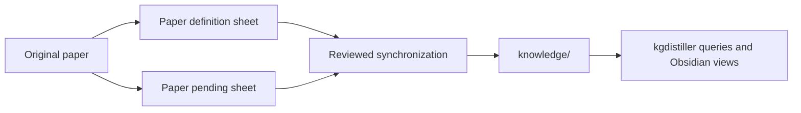

# Paper sheets as knowledge inputs

`compile-paper-sheets` establishes two upstream authoring artifacts:
`paper-def-sheet.md` and `paper-pending-sheet.md`. Their contract is maintained
with the product Skill and evolves with the consuming knowledge data format.

The paper definition sheet preserves paper-scoped noun-like concepts and their
definitions, plus a separate factual-relation section with complete roles,
conditions, measurements, source evidence and epistemic qualifications. The
pending sheet preserves unexplained terms, use sites, required meanings and
reviewed external-definition resolutions. The sheets are reviewable source
material, not a second current knowledge database.

## One visible interaction root

Keep `knowledge/` as the canonical product interaction root so its content and
views remain available in Obsidian. The sheets stay with the selected paper's
source material. Do not create an independently edited parallel library under
`.kgdistiller/` or an experiment output directory.

`knowledge/` currently contains durable entries, registries and committed graph
relationships as well as generated artifacts. Its graph generation preserves
previously accepted semantic relationships; it is not wholly reconstructible
from definition prose alone. Back up durable accepted state according to the
portable-store contract. `knowledge/build/` retains its existing transient role.

## Synchronization contract

Review a source-scoped update including edits, additions, resolved pending
items and withdrawals. Preserve unrelated papers and user annotations, and
identify owned contributions by explicit references rather than a name match.
The target's current supported generation remains active until the reviewed
update commits and validates. Mark upstream changes awaiting synchronization;
do not silently serve old content as a completed new update.

Use the product's supported write adapter and transactional ingest when it can
preserve the complete reviewed payload. Keep definition content, formulas,
conditions, scientific evidence, participant roles, relation scope and pending
history together. A formatting change to the upstream contract must be paired
with the consuming model/adapter and round-trip validation. Derived JSON or
adapter projections are not independently edited source authorities.

The caller-supplied compiled library currently provides read-only retrieval;
it is not the canonical graph's write protocol. First-class n-ary relation
selection and a lossless sheet-to-canonical adapter are not yet implemented.
The Skill must preserve unsupported content and identify that adapter gap,
rather than flattening facts or claiming a smaller transaction synchronized
the entire sheet. This document establishes the direction and compatibility
requirement, not an implemented `sheets sync` command.

The detailed upstream records and safe synchronization behavior are in the
Skill's [sheet contract](../skills/compile-paper-sheets/references/sheet-contract.md)
and [sync contract](../skills/compile-paper-sheets/references/sync-contract.md).
