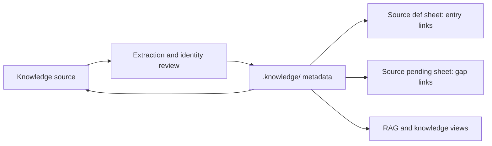

# Paper sheets as source-scoped projections

Papers are one use case of the [shared knowledge model](concepts-and-relations.md).
`compile-knowledge-sheets` prepares source-grounded metadata updates and produces
lightweight definition and pending views. Mathematical notes, CS notes, blogs
and other knowledge files use the same workflow.

The diagram shows the intended reviewed flow, not a new synchronization API.
Sheets may intentionally cover only selected concepts or passages. Record that
partial coverage and preserve other rows. Full source distillation is explicitly
requested; even a complete extraction does not certify the user's understanding.

Reviewed entries in `.knowledge/entries/` are the knowledge nodes; each cites
its source by path and line range and quotes those lines as Evidence, and the
source's passages remain the evidence. Accepted edges live in
`.knowledge/edges.jsonl`. Source-side sheets link to those records; they do not
hold another complete editable copy of the knowledge. An edit proposed through
a sheet updates the entries through a reviewed transaction before the view is
regenerated.

## One hidden knowledge root

Knowledge lives in the hidden `.knowledge/` tree. Obsidian sees it through the
kgdistiller plugin's hidden-folder indexing, which keeps `build/` out of the
native index by default. Its entries and accepted semantic relationships are
the durable state; they cannot be reconstructed from definition prose alone.
Preserve them with the sources in the base's backup.
`.knowledge/build/` remains transient.

A paper definition view contains explained source-scoped concepts, types, exact
locations and actual metadata links. Full definitions, formulas, conditions,
factual assertions and experimental applications belong in knowledge records.
The pending view identifies direct gaps, including unexplained terms and
available definitions the user has not yet understood. `understanding` and
`pending_prerequisites` live on the owning atomic entry. Each entry records only
its immediate layer; further dependencies are considered when the user chooses
to study that item. A locally
explained inherited concept can have a scoped entry without claiming first origin.
Unexplained terms require applicability review against a primary defining source.

## Reviewed update and projection refresh

Stage complete new or changed metadata in `.knowledge/build/reviews/`. Compare it
against accepted content and explicit identities; review additions, edits,
resolved gaps and withdrawals together. Preserve other sources and user
annotations. Removing one source contribution does not authorize deleting a
shared identity. A display-name match does not establish ownership.

Use supported transactional ingest when it preserves the reviewed payload.
After a committed receipt and a passing `kgdistiller check`, refresh source
views with links to the actual accepted entries. Unsupported full n-ary assertions,
applications and rich gap history remain explicit unapplied proposals. Simple
direct prerequisite gaps and personal understanding use the supported entry
fields. Do not fabricate
entries or gap links, flatten assertions, or call a smaller transaction complete
synchronization. Existing authored paper files are not automatically replaced.

The caller-supplied compiled library is read-only retrieval input. A general
lossless metadata adapter and automatic sheet synchronization are not yet
implemented. The bundled Skill's
[sheet contract](../skills/compile-knowledge-sheets/references/sheet-contract.md)
and [update contract](../skills/compile-knowledge-sheets/references/update-contract.md)
state the supported handoff and projection boundary.
